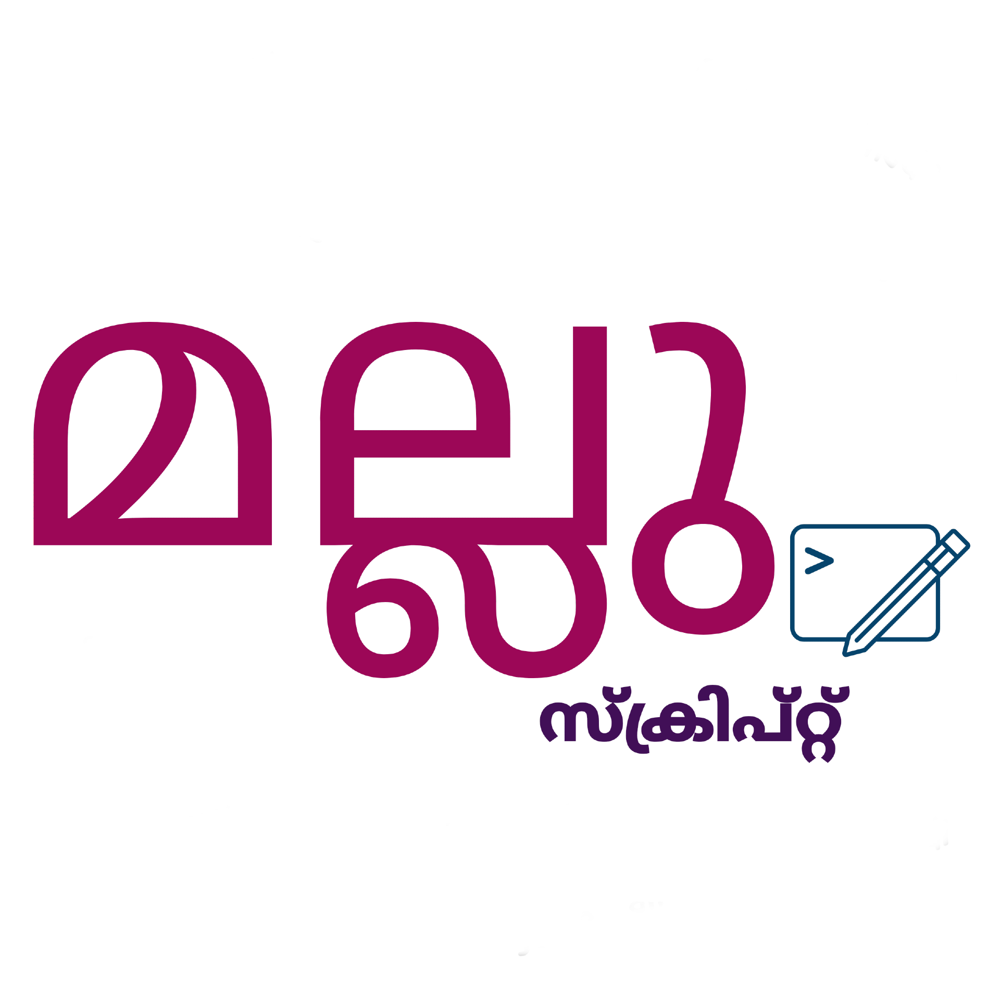

# Mallu Script
<p align="center">
<br/>
<a href="https://github.com/actions/toolkit"></a>
<a href="https://github.com/Sreyas-Sreelal/malluscript/pulls"></a>
<a href="https://github.com/Sreyas-Sreelal/malluscript/issues"></a>
<a href="https://github.com/Sreyas-Sreelal/malluscript/blob/master/LICENSE"></a>
<p align="center">
<a href="https://discord.gg/5CMMf4ckuk"></a>
</p></p>


Malluscript is an esoteric scripting language based on manglish and malayalam memes. The language uses trending Malayalam memetic words as keywords. The language is not strictly type-safe and uses only two datatypes strings and integers. Currently, malluscript is on the development phase and undergoing vigorous changes. Always check the release section for pre-built binaries for the interpreter.

**Note:** For support please join our [Discord](https://discord.gg/5CMMf4ckuk).

## Installation
Either download precompiled binaries from release page or clone this repository

`git clone https://github.com/sreyas-sreelal/malluscript.git`

## Building
The interpreter can be compiled as follows

```
cd malluscript
cargo build --release
```
Note: You require rust compiler installed on your machine in order to compile the interpreter

## Executing malluscript programs
Malluscript can be used in two ways
### Interactive shell
To start the interactive shell, just run following in the terminal

```
./malluscript

```
Something like this would come
```
Mallu Script Version 0.1.0
>> 
```
Here you can start writing your malluscript codes on the way!

### Run malluscript program files
Write the code in the file with `.ms` extension and execute it as follows

```
./malluscript file_name.ms
```

## Language Syntax And Grammar

Basic arithmetic operations can be done using `+`,`-`,`*`,`/`,`%` (modulo). Every expression ends with `;`. `{` and `}` introduces a new block like c like languages. Every keyword has alternate ones too, each with different dialects and also in Malayalam unicodes.

### Basic I/O operations
* Printing or writing to console is done as follows
    ```ms
    ezhuthuga "hello world";
    ezhuthuga variable;
    ezhuthuga "Onnum randum kottiyal " + 1+2 + " aanu"; 
    ``` 
  * Alternate Keywords
    * `ezhuthuka`
    * `ezhuthuga`
    * `kanikuka`
    * `kanikuga`
    * `എഴുതുക`
    * `കാണിക്കുക`

* In order to get keyboard input from the user
  
  For integer inputs
  ```
  variable = akam_vangikuga;
  ```
  * Alternate Keywords
    * `akam_vangikuga`
    * `akkam_vangikuga`
    * `അക്കംവാങ്ങിക്കുക`

  For string inputs
  ```
  variable = vachakam_vangikuga;
  ```
  * Alternate Keywords
    * `vachakam_vangikuga`
    * `vachakam_vangikuka`
    * `vachagam_vangikuga`
    * `vachagam_vangikuka`
    * `വാചകംവാങ്ങിക്കുക`

### Datatypes and Storage
Malluscript is not strictly type-safe.The language, currently, supports only integer,float and string literals as datatypes.

To assign it some value and declare a variable

```
variable_name = 1;
second_var = "ente string";
```

## Conditional Statements And Expressions
The conditional expression has the following syntax

```
i um 0 um thullyaman enkil {

} adhallengil {

}
```
The above snippet checks whether i equal to 0 and if yes the code in the first block will execute otherwise block defined by `adhallengil` will get executed.

In general
* `i um 0 um thullyaman enkil` checks if i is equals to 0
* `i um 0 um thullyamalla enkil` checks if i not equals to 0
* `i nekal 0 cheruthan enkil` checks if 0 is less than i
* `i nekal 0 veluthan enkil` checks if 0 is greater than i

  * Alternate Keywords
    * **enkil**
      * `engil`
      * `എങ്കിൽ`
    * **thullyamalla**
      * `onnalla`
      * `തുല്യമല്ല`
      * `ഒന്നല്ല`
    * **thullyaman**
      * `onnan`
      * `തുല്യമാണ്`
      * `ഒന്നാണ്`
    * **um**
      * `ഉം`
    * **ne_kal**
      * `നെകാൾ`
    * **veluthan**
      * `വലുതാണ്`
    * **cheruthan**
      * `ചെറുതാണ്`
    * **adhallengil**
      * `adhallenkil`
      * `അതല്ലെങ്കിൽ`

#### Agglutination of conditional statements
Conditional statements like `thullyaman enkil` can be agglutinated together like `thullyamanenkil`

## Iterative Statements Or Loops

The loops in malluscript look as follows
```
0 nekal i veluthan enkil avarthikuga {
  i = i-1;
}
```
  * Alternative Keywords
    * `aavarthikuga`
    * `avarthikuga`
    * `aavarthikuka`
    * `avarthikuka`
    * `ആവർത്തിക്കുക`

## Functions
The functions definition in malluscript are defined as follows.
```
ente_function(variable1,variable2) {
  ezhuthuga variable1 + variable2;
}
```
The functions can also return values.
```
factorial(n) {
    n um 0 um thullyaman enkil {
        kodukuga 1;   
    }
    kodukuga n * factorial<n-1>;
}
```
  * Alterative keywords for `kodukuga`
    * `kodukuka`
    * `madakiayakuga`
    * `madakiayakuka`
    * `കൊടുക്കുക`
    * `മടക്കിഅയയ്ക്കുക`

To call a function function name followed by angle brackets are used.
```
my_function<arg1,arg2>;
```

## Example
A simple program to find factorial in malluscript would be 

```ms
kanikuga "Input number:";
num = akam_vangikuga;
factorial = 1;

0 um num um thullyamalla enkil avarthikuga {
    factorial = factorial * num;
    num = num -1;
}

kanikuga "Factoral is : " + factorial + "\n";

```
Same in pure Malayalam would be
```ms
എഴുതുക "ദയവായി നമ്പർ തരുക: ";
നമ്പർ = അക്കംവാങ്ങിക്കുക;
ഫാക്ടോറിയൽ = 1;

0 ഉം നമ്പർ ഉം തുല്യമല്ല എങ്കിൽ {
  ഫാക്ടോറിയൽ = ഫാക്ടോറിയൽ * നമ്പർ;
  നമ്പർ = നമ്പർ -1;
}

എഴുതുക "ഫാക്ടോറിയൽ : " + ഫാക്ടോറിയൽ + "\n";
```

More examples can be found in [examples](examples)

## Notes
The language as mentioned above is under the development phase and its structure can change overnight, suddenly. This language is not meant to disrespect anyone and wrote just for fun.

Any kind of contribution is always welcome. If you have any ideas or improvements to provide for this project open a pull request or if you have any difficulties using this language open an issue :) 
